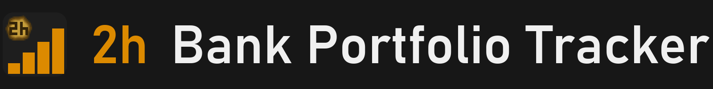
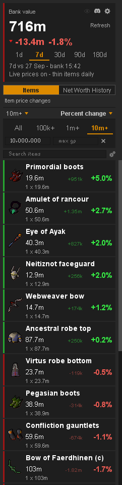
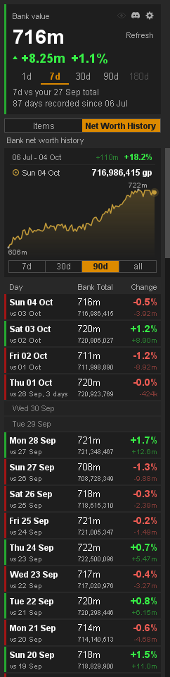

- See at a glance which of your items are rising or falling. 
- Track and display your net worth over time.

<table width="100%">
<tr>
<td valign="top">

## What it shows

- **Bank value.** Everything you own, price displayed, and how much it changed over the last day, week, month, 3 months or 6 months.
- **Items tab.** Every item you own, what it is worth, and its change in gp and %. Green went up, red went down, biggest movers first.
- **Net Worth History tab.** Your net worth saved once a day, shown as a chart and a list of days.

## Quick guide

1. **Start.** Open your bank once. After that it works with the bank closed.
2. **Refresh.** The list updates when you close the bank. If Refresh glows, click it to update now.
3. **Switch tabs.** Items or Net Worth History, under the bank value.
4. **Pick a window.** 1d, 7d, 30d, 90d or 180d, on the card.
5. **Sort.** By % change, gp change, item price or stack price. Click the lit one again to flip.
6. **Filter.** Items over 100k, 1m or 10m, or your own min and max. Or type part of a name in the search box above the list.
7. **Open an item.** Click any item to see its exact figures. Click it again to close.
8. **Settings.** Click the settings icon to include or exclude your inventory, worn gear, Grand Exchange offers, coins and alch-only untradeables, and to turn live prices and hover text on or off.

## Good to know

- **Prices** are the Grand Exchange guide price, updated daily, plus live prices for actively traded items.
- **Untradeables** made from tradeable items, like a charged bow or crystal armour, count at their parts' prices.
- **Grand Exchange offers** count too: unsold items, bought items waiting to be collected, and the coins committed or waiting in your offers.
- **Privacy.** No account or bank data is ever uploaded. The plugin only fetches prices.
- **Something wrong?** Tell us in the Discord.

</td>
<td width="28"></td>
<td align="right" valign="top" width="235">

 

</td>
</tr>
</table>

 

<table width="100%">
<tr><td colspan="3"></td></tr>
<tr>
<td valign="top">

## Net Worth History

- **Your account's net worth over time.** Displayed as a chart and a list of days. Saved once a day, on each day you log in.
- **Chart.** Pick 7d, 30d, 90d or all. Rest the pointer on the line to read that day's total.
- **Every day listed.** Each day's total and its change, newest first.
- **Follows your settings.** Turn coins off and the whole chart redraws.
- **Start on it.** Pick "Tab to open on startup" in the settings to open on this tab.

</td>
<td width="28"></td>
<td align="right" valign="top" width="235">

 

</td>
</tr>
</table>

---

<strong>Found a bug or have an idea?</strong> Join the <a href="https://discord.gg/nsam4CfWzf">2hBuilds Discord</a>.

Want every figure and setting explained? Read the <a href="https://github.com/2hBuilds/bank-portfolio-tracker/blob/main/DETAILS.md">full details</a>.
