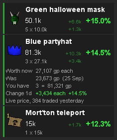

<strong>Is your bank going up or down? Find out in one glance.</strong>

Every item you own, priced and tracked, with the winners and losers sorted for you.

<table width="100%">
<tr>
<td valign="top">

## What it shows

- **Bank value.** Everything you own, priced, and how much it changed over the last day, week, month, 3 months or 6 months.
- **Every item.** How many you have, what they are worth, and the change in gp and %.
- **Winners and losers.** Green went up, red went down, biggest movers first.

## Quick guide

1. **Start.** Open your bank once. After that it works with the bank closed.
2. **Refresh.** The list updates when you close the bank. If Refresh glows, click it to update now.
3. **Pick a window.** 1d, 7d, 30d, 90d or 180d, on the card.
4. **Sort.** By % change, gp change, item price or stack price. Click the lit one again to flip.
5. **Filter.** Items over 100k, 1m or 10m, or your own min and max.
6. **Settings.** Click the settings icon to include or exclude your inventory, worn gear, coins and untradeable items, and to turn live prices and hover text on or off.

</td>
<td width="28"></td>
<td align="right" valign="top" width="235">

 

</td>
</tr>
</table>

<table width="100%">
<tr>
<td valign="top">

## Item details

- **Click any item** to open its exact figures: worth now, what it was, how many you have, and the change for the window.
- **Click it again** to close.

## Good to know

- **Prices** are the Grand Exchange guide price, updated daily, plus live prices for actively traded items.
- **Privacy.** No account or bank data is ever uploaded. The plugin only fetches prices.

</td>
<td width="28"></td>
<td align="right" valign="top" width="235">

 

</td>
</tr>
</table>

---

Want every figure and setting explained? Read the <a href="https://github.com/2hBuilds/bank-portfolio-tracker/blob/main/DETAILS.md">full details</a>.
